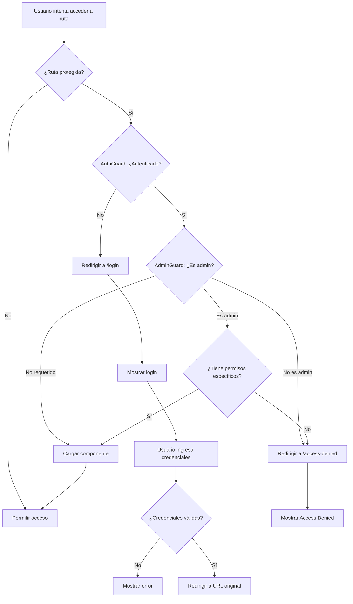

# 🛡️ LAB 4 - Route Guards: Seguridad y Autenticación Avanzada

## 🎯 Descripción del Laboratorio

Bienvenidos al **Laboratorio 4** de Angular v18 para **PROVIAS DESCENTRALIZADO**. En este laboratorio implementaremos el **sistema de seguridad** de nuestra aplicación usando **Route Guards**.

Los Route Guards son como el **sistema de seguridad de un edificio corporativo de alta tecnología**: verifican credenciales, validan permisos y controlan el acceso a diferentes áreas según el nivel de autorización del usuario.

---

## 📖 Conceptos Teóricos Implementados

### 🛡️ ¿Qué son los Route Guards?

Los Route Guards son **interceptores de navegación** que se ejecutan antes de que el usuario acceda a una ruta específica. Son como checkpoints de seguridad que verifican si el usuario cumple con los requisitos necesarios.

**Analogía del Edificio Corporativo:**
- **Lobby de Recepción**: AuthGuard - verifica que tengas tarjeta de empleado
- **Piso Ejecutivo**: AdminGuard - verifica que tengas autorización especial
- **Salida de Emergencia**: CanDeactivate - verifica que no olvides documentos importantes
- **Lazy Loading**: Como elevadores que solo se activan cuando los necesitas

### 🔐 Tipos de Guards Implementados

#### 1. **AuthGuard (CanActivate)**
```typescript
@Injectable()
export class AuthGuard implements CanActivate {
  canActivate(): Observable<boolean> {
    // Verificar si el usuario está autenticado
    if (this.authService.isAuthenticated()) {
      return of(true);
    } else {
      this.router.navigate(['/login']);
      return of(false);
    }
  }
}
```
- **Propósito**: Verificar autenticación básica
- **Analogía**: Como el guardia principal que verifica tu tarjeta de identificación

#### 2. **AdminGuard (CanActivate + Authorization)**
```typescript
@Injectable()
export class AdminGuard implements CanActivate {
  canActivate(route: ActivatedRouteSnapshot): Observable<boolean> {
    const user = this.authService.getCurrentUser();
    const requiredPermissions = route.data?.['requiredPermissions'] || [];
    
    if (user?.role === 'admin' && this.hasPermissions(requiredPermissions)) {
      return of(true);
    } else {
      this.router.navigate(['/access-denied']);
      return of(false);
    }
  }
}
```
- **Propósito**: Verificar permisos específicos y roles
- **Analogía**: Como el control de acceso al piso ejecutivo

#### 3. **UnsavedChangesGuard (CanDeactivate)**
```typescript
export interface ComponentCanDeactivate {
  canDeactivate(): boolean;
}

@Injectable()
export class UnsavedChangesGuard implements CanDeactivate<ComponentCanDeactivate> {
  canDeactivate(component: ComponentCanDeactivate): boolean {
    if (component.canDeactivate()) {
      return true;
    }
    
    return confirm('¿Estás seguro de salir sin guardar los cambios?');
  }
}
```
- **Propósito**: Prevenir pérdida de datos no guardados
- **Analogía**: Como el protocolo de salida que verifica que no olvides documentos

---

## 🏗️ Arquitectura del Proyecto

```
src/app/
├── guards/                    # 🛡️ Guards de seguridad
│   ├── auth.guard.ts         # Guard de autenticación
│   ├── admin.guard.ts        # Guard de autorización
│   └── unsaved-changes.guard.ts # Guard de cambios no guardados
├── services/                  # 🔧 Servicios del sistema
│   └── auth.service.ts       # Servicio de autenticación
├── models/                    # 📝 Modelos de datos
│   └── auth.ts              # Interfaces de autenticación
├── components/               # 🧩 Componentes reutilizables
│   └── login/               # Componente de login
├── pages/                    # 📄 Páginas protegidas
│   ├── dashboard/           # Dashboard (AuthGuard)
│   ├── admin/              # Panel admin (AuthGuard + AdminGuard)
│   ├── users/              # Gestión usuarios (AuthGuard)
│   ├── projects/           # Gestión proyectos (AuthGuard)
│   ├── access-denied/      # Página de acceso denegado
│   └── not-found/          # Página 404
└── app.routes.ts           # Configuración de rutas con guards
```

---

## 🔍 Análisis Detallado del Código

### 🛡️ 1. AuthGuard - Autenticación Básica

```typescript
export const authGuard: CanActivateFn = (route, state) => {
  const authService = inject(AuthService);
  const router = inject(Router);

  return authService.isAuthenticated$.pipe(
    map(isAuthenticated => {
      if (isAuthenticated) {
        return true;
      } else {
        // Guardar URL de retorno para después del login
        router.navigate(['/login'], { 
          queryParams: { returnUrl: state.url } 
        });
        return false;
      }
    })
  );
};
```

**🎓 Características Clave:**
- **Función Guard moderna**: Usa CanActivateFn en lugar de clases
- **Reactive**: Se basa en Observables para estado dinámico
- **Return URL**: Guarda dónde quería ir el usuario para redirigirlo después del login
- **Logging**: Registra intentos de acceso para auditoría

### 👑 2. AdminGuard - Autorización Granular

```typescript
export const adminGuard: CanActivateFn = (route, state) => {
  const authService = inject(AuthService);
  const router = inject(Router);
  
  return authService.currentUser$.pipe(
    map(user => {
      // Verificar rol de administrador
      if (user?.role !== 'admin') {
        router.navigate(['/access-denied']);
        return false;
      }
      
      // Verificar permisos específicos
      const requiredPermissions = route.data?.['requiredPermissions'] || [];
      const hasPermissions = requiredPermissions.every(
        permission => user.permissions.includes(permission)
      );
      
      if (!hasPermissions) {
        router.navigate(['/access-denied']);
        return false;
      }
      
      return true;
    })
  );
};
```

**🎓 Características Clave:**
- **Verificación de Rol**: Solo usuarios admin pueden pasar
- **Permisos Granulares**: Verifica permisos específicos via route.data
- **Doble Verificación**: Primero rol, luego permisos específicos

### 🔐 3. AuthService - Gestión de Estado de Autenticación

```typescript
@Injectable({
  providedIn: 'root'
})
export class AuthService {
  private currentUserSubject = new BehaviorSubject<AuthUser | null>(null);
  private isAuthenticatedSubject = new BehaviorSubject<boolean>(false);

  // Mock users para demostración
  private mockUsers: AuthUser[] = [
    {
      id: 1,
      username: 'admin',
      email: 'admin@provias.gob.pe',
      fullName: 'Administrador PROVIAS',
      role: 'admin',
      permissions: ['admin:panel', 'admin:users', 'admin:settings', 'admin:logs']
    },
    {
      id: 2,
      username: 'user',
      email: 'user@provias.gob.pe',
      fullName: 'Usuario PROVIAS',
      role: 'user',
      permissions: ['dashboard:view', 'projects:view', 'users:view']
    }
  ];

  // Observables públicos
  get currentUser$(): Observable<AuthUser | null> {
    return this.currentUserSubject.asObservable();
  }

  get isAuthenticated$(): Observable<boolean> {
    return this.isAuthenticatedSubject.asObservable();
  }

  // Login simulado
  login(username: string, password: string): Observable<LoginResult> {
    const user = this.mockUsers.find(u => 
      u.username === username && password === 'password123'
    );

    if (user) {
      this.setCurrentUser(user);
      return of({ success: true, user });
    } else {
      return of({ success: false, error: 'Credenciales incorrectas' });
    }
  }

  // Verificación de permisos
  hasPermission(permission: string): boolean {
    const user = this.currentUserSubject.value;
    return user?.permissions.includes(permission) || false;
  }
}
```

### 📚 4. Configuración de Rutas con Guards

```typescript
export const routes: Routes = [
  // 🔑 Rutas públicas
  { path: 'login', component: LoginComponent },
  { path: 'access-denied', component: AccessDeniedComponent },
  
  // 🛡️ Rutas protegidas con AuthGuard
  {
    path: 'dashboard',
    loadComponent: () => import('./pages/dashboard/dashboard.component')
      .then(m => m.DashboardComponent),
    canActivate: [AuthGuard],
    title: 'Dashboard - PROVIAS'
  },
  
  // 👑 Rutas de administración - Doble protección
  {
    path: 'admin',
    loadComponent: () => import('./pages/admin/admin.component')
      .then(m => m.AdminComponent),
    canActivate: [AuthGuard, AdminGuard],
    title: 'Panel de Administración - PROVIAS',
    data: {
      requiredPermissions: ['admin:panel']
    }
  },
  
  // 🔄 Rutas con permisos específicos
  {
    path: 'admin/users',
    loadComponent: () => import('./pages/admin/admin.component')
      .then(m => m.AdminComponent),
    canActivate: [AuthGuard, AdminGuard],
    data: {
      requiredPermissions: ['admin:users']
    }
  }
];
```

---

## 🎮 Funcionalidades Implementadas

### ✅ 1. Sistema de Autenticación
- Login con usuarios mock (admin/user)
- Persistencia de sesión en localStorage
- Estado reactivo de autenticación
- Logout con limpieza de estado

### ✅ 2. Autorización Granular
- Verificación de roles (admin vs user)
- Permisos específicos por ruta
- Control de acceso a funcionalidades

### ✅ 3. Guards de Protección
- **AuthGuard**: Protege rutas que requieren login
- **AdminGuard**: Protege rutas de administración
- **UnsavedChangesGuard**: Previene pérdida de datos

### ✅ 4. Lazy Loading Seguro
- Componentes se cargan solo cuando se necesitan
- Guards se ejecutan ANTES de cargar el código
- Optimización de rendimiento

### ✅ 5. Experiencia de Usuario
- Páginas de error personalizadas (Access Denied, 404)
- Redirección inteligente después del login
- Mensajes informativos sobre protección de rutas

---

## 🚀 Instrucciones para Ejecutar

### 1. **Instalación**
```bash
cd lab-4-guards
npm install
```

### 2. **Desarrollo**
```bash
ng serve --port 4204
```
Abre tu navegador en: `http://localhost:4204`

### 3. **Build de Producción**
```bash
ng build
```

---

## 🔐 Credenciales de Prueba

Para probar el sistema de guards, usa estas credenciales:

### 👤 **Usuario Regular**
- **Username**: `user`
- **Password**: `password123`
- **Acceso**: Dashboard, Users, Projects (solo lectura)

### 👑 **Administrador**
- **Username**: `admin`
- **Password**: `password123`
- **Acceso**: Todas las rutas + Panel de Administración

---

## 🔬 Ejercicios Prácticos para Estudiantes

### 🎯 **Ejercicio 1: Flujo de Autenticación**
1. Ve a `http://localhost:4204` (redirige automáticamente a login)
2. Intenta acceder a `/dashboard` sin login (te redirige a login)
3. Haz login como `user` / `password123`
4. Observa cómo te redirige a donde querías ir originalmente

### 🎯 **Ejercicio 2: Autorización de Admin**
1. Con usuario regular, intenta acceder a `/admin`
2. Observa la página "Access Denied"
3. Haz logout y login como `admin` / `password123`
4. Ahora puedes acceder a `/admin` y sus subrutas

### 🎯 **Ejercicio 3: Guards en Acción**
1. Abre DevTools (F12) y observa los logs
2. Intenta navegar a diferentes rutas
3. Observa cómo se ejecutan los guards
4. Ve los mensajes de autorización en la consola

### 🎯 **Ejercicio 4: Lazy Loading**
1. Abre Network tab en DevTools
2. Navega a diferentes páginas
3. Observa cómo se cargan chunks de código bajo demanda
4. Ve que admin.component se carga solo cuando accedes a `/admin`

### 🎯 **Ejercicio 5: UnsavedChangesGuard (Avanzado)**
1. Ve a una página con formulario
2. Modifica datos sin guardar
3. Intenta navegar a otra página
4. Observa el prompt de confirmación

---

## 🛡️ Flujo de Seguridad Completo



---

## 🎓 Conceptos Avanzados Demostrados

### 1. **Functional Guards (Angular 18)**
```typescript
// Nuevo estilo funcional
export const authGuard: CanActivateFn = (route, state) => {
  const authService = inject(AuthService);
  return authService.isAuthenticated$;
};

// Estilo clásico (para comparación)
@Injectable()
export class AuthGuardClass implements CanActivate {
  constructor(private authService: AuthService) {}
  canActivate() {
    return this.authService.isAuthenticated$;
  }
}
```

### 2. **Dependency Injection en Guards**
```typescript
export const complexGuard: CanActivateFn = (route, state) => {
  // Inyección múltiple de dependencias
  const authService = inject(AuthService);
  const router = inject(Router);
  const logger = inject(LoggerService);
  const notification = inject(NotificationService);
  
  return authService.isAuthenticated$.pipe(
    tap(isAuth => logger.log('Auth check:', isAuth)),
    tap(isAuth => !isAuth && notification.error('Please login'))
  );
};
```

### 3. **Route Data para Configuración Granular**
```typescript
{
  path: 'admin/critical',
  component: CriticalComponent,
  canActivate: [AuthGuard, AdminGuard],
  data: {
    requiredPermissions: ['admin:critical', 'security:level5'],
    requiresTwoFactor: true,
    auditLog: true
  }
}
```

---

## 🐛 Debug y Herramientas de Desarrollo

### 1. **Console Logging**
```javascript
// En AuthGuard
🛡️ [AuthGuard] Verificando autenticación para ruta: /dashboard
✅ [AuthGuard] Usuario autenticado: admin@provias.gob.pe
🚫 [AuthGuard] Acceso denegado - usuario no autenticado

// En AdminGuard  
👑 [AdminGuard] Verificando permisos admin para: /admin/users
✅ [AdminGuard] Usuario tiene rol admin y permisos requeridos
🚫 [AdminGuard] Acceso denegado - permisos insuficientes
```

### 2. **Angular DevTools**
- Inspecciona el estado de AuthService
- Observa el flujo de guards en tiempo real
- Ve las subscripciones activas

### 3. **Network Monitoring**
- Observa lazy loading de componentes
- Ve que no hay requests innecesarios
- Confirma que guards bloquean carga de componentes no autorizados

---

## ⚠️ Consideraciones de Seguridad

### 🔒 **Seguridad Real vs Demo**

**En esta demo:**
- Credenciales hardcodeadas
- Tokens simulados en localStorage
- Guards solo en frontend

**En producción deberías:**
- Usar JWT tokens reales
- Validar en backend SIEMPRE
- Implementar refresh tokens
- Usar HTTPS en todas las comunicaciones
- Hashear passwords con bcrypt o similar

### 🛡️ **Mejores Prácticas**
```typescript
// ❌ NUNCA hagas esto en producción
const isAdmin = localStorage.getItem('userRole') === 'admin';

// ✅ Mejor enfoque
const isAdmin = this.authService.hasValidToken() && 
                this.authService.hasRole('admin') && 
                await this.backendService.verifyPermissions();
```

---

## 📚 Recursos Adicionales de Aprendizaje

### 📖 **Documentación Oficial**
- [Angular Route Guards](https://angular.dev/guide/router/guards)
- [CanActivate Interface](https://angular.dev/api/router/CanActivate)
- [Dependency Injection](https://angular.dev/guide/di)

### 🎥 **Videos Recomendados**
- "Angular Security Best Practices" - Angular Team
- "JWT Authentication with Angular" - Fireship
- "Route Guards Deep Dive" - Angular University

### 📝 **Artículos Técnicos**
- "Frontend Security is a Delusion" - OWASP
- "Angular Security Guide" - Official Angular Blog
- "JWT vs Sessions" - Auth0 Blog

---

## 🎓 Mensaje del Instructor

> "La seguridad en aplicaciones web es como el sistema inmunológico del cuerpo humano: funciona mejor cuando tiene múltiples capas de defensa. Los Route Guards son solo la primera línea de defensa en el frontend, pero nunca deben ser la única. Recuerden siempre: 'Never trust the client, always validate on the server'. Este laboratorio les enseña las herramientas, pero la responsabilidad de usarlas correctamente en producción es suya."
> 
> **— Ing. Jhonny Alexander Ramirez Chiroque**

---

## 🏗️ Proyecto PROVIAS - Contexto de Seguridad Real

En el sistema real de **PROVIAS DESCENTRALIZADO**, la seguridad es crítica porque maneja:

### 🔐 **Información Sensible**
- Presupuestos millonarios de obras públicas
- Datos personales de empleados
- Información contractual con proveedores
- Reportes financieros del estado

### 👥 **Diferentes Niveles de Acceso**
- **Técnicos de Campo**: Solo pueden ver proyectos asignados
- **Jefes de Proyecto**: Gestión completa de sus proyectos
- **Administradores**: Acceso total al sistema
- **Auditores**: Solo lectura con logs completos

### 🛡️ **Medidas de Seguridad Implementadas**
- Autenticación multifactor obligatoria
- Sesiones que expiran automáticamente
- Logs de auditoría completos
- Validación de permisos en cada operación
- Cifrado de datos sensibles

### ⚖️ **Cumplimiento Legal**
- Ley de Transparencia y Acceso a la Información
- Normas de Contrataciones del Estado
- Protección de Datos Personales
- Auditorías de Contraloría General

---

## 🔍 Evaluación de Aprendizaje

### ✅ **Checklist de Conceptos Dominados**

- [ ] Entiendo qué son los Route Guards y cuándo usarlos
- [ ] Puedo implementar AuthGuard para autenticación
- [ ] Sé crear AdminGuard para autorización granular
- [ ] Comprendo el flujo de ejecución de múltiples guards
- [ ] Puedo configurar lazy loading con guards
- [ ] Entiendo la diferencia entre autenticación y autorización
- [ ] Sé manejar errores de acceso apropiadamente
- [ ] Comprendo las limitaciones de seguridad frontend

### 🏆 **Criterios de Éxito**
1. **Funcional**: Todos los guards funcionan correctamente
2. **Seguridad**: Rutas están protegidas apropiadamente  
3. **UX**: Mensajes de error claros y navegación intuitiva
4. **Performance**: Lazy loading optimiza carga inicial
5. **Comprensión**: Puedo explicar el flujo de seguridad completo

---

**© 2025 PROVIAS DESCENTRALIZADO - Laboratorio Angular v18 | Seguridad Web para Infraestructura Nacional**